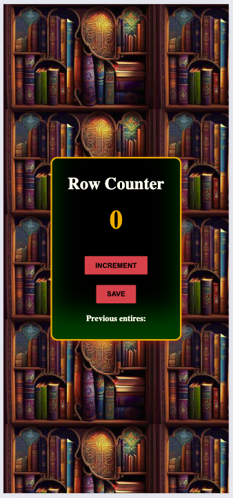
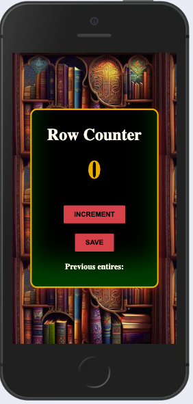
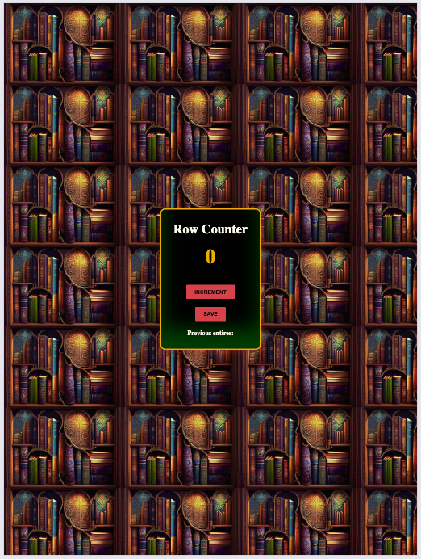
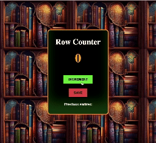

# About Project

This project was about remembering some bits and always learning more.
 The project created was inspired by how many people can enter the library so I can count, store and display the data by using JavaScript, HTML and CSS.

## What I used to learn

The project was inspired by the [Scrimba Course](https://scrimba.com) with Per Harald as Instructor.

## Application Preview

